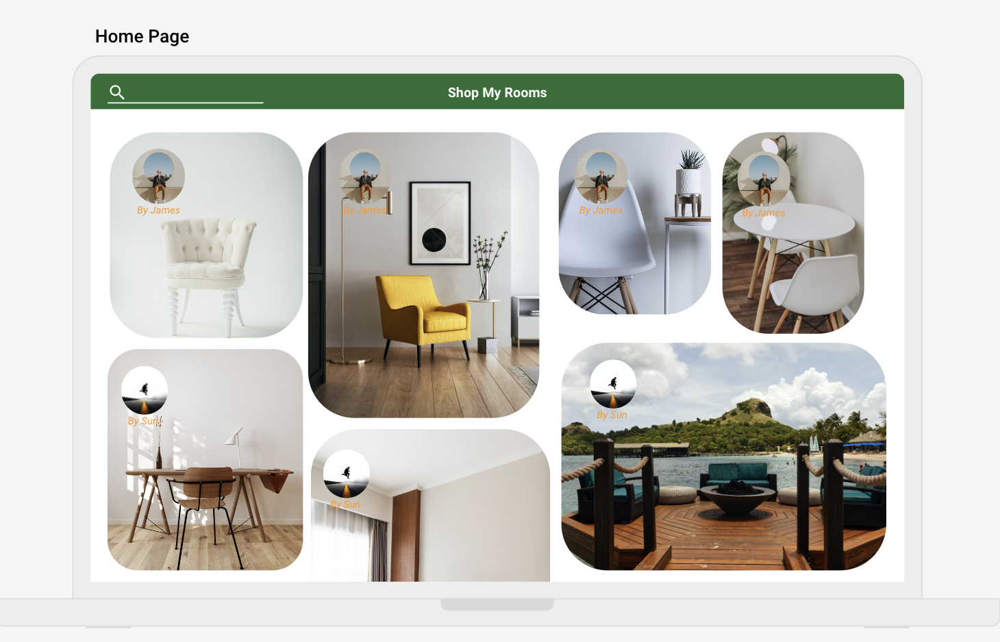
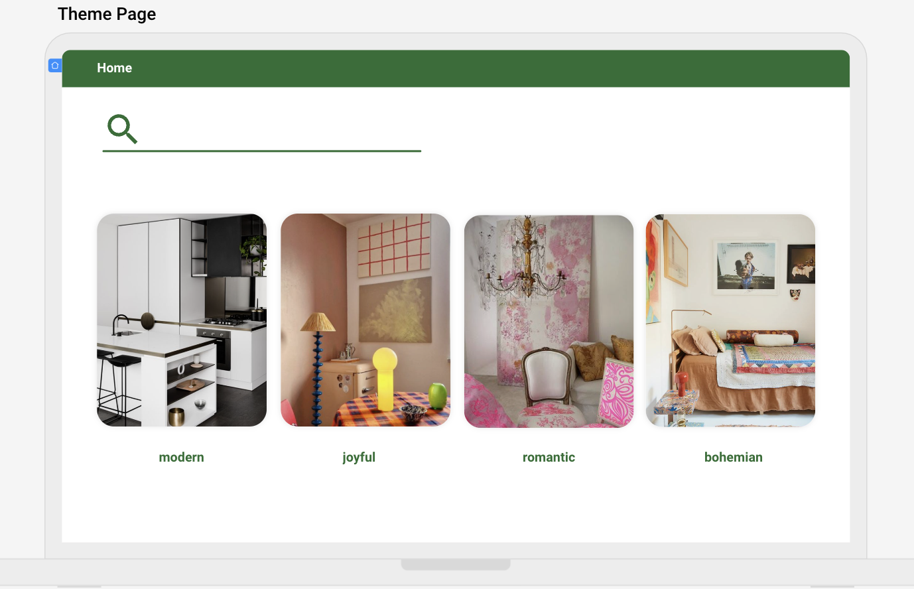
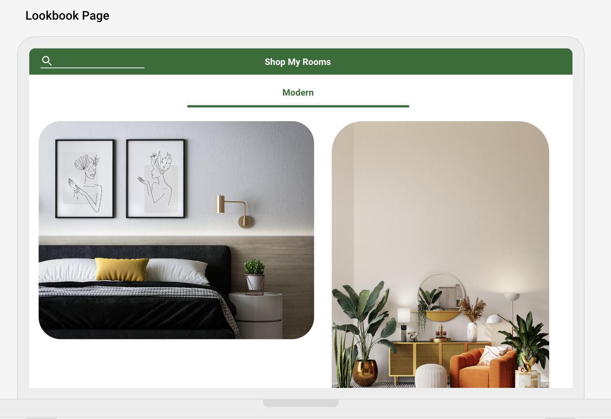
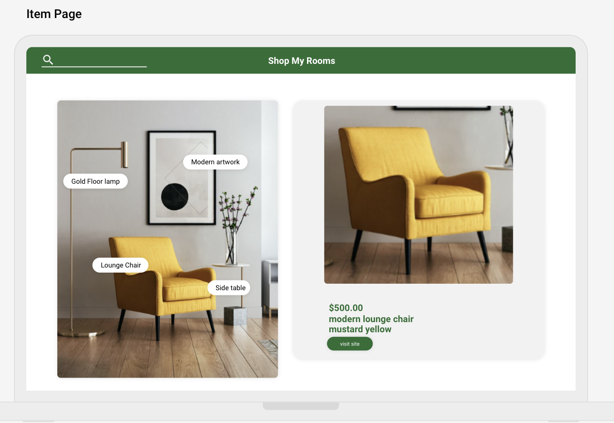

# shop my rooms

## description
As a user and shopper, I want to be able to navigate through different themes that contain suitable images. Once I select a theme, I expect to receive multiple suggestions with images that already have items. With the provided lookbook, I should be able to effortlessly browse through all the items on the image, and each item should have a link for easy access to more information or purchasing.

## technologies 
1. backend : postgresql
2. frontend : django
3. deploy : render.com neon.tech

## installation steps

## wireframe 

## ERD 

## future features

## link

